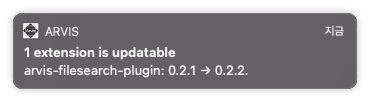
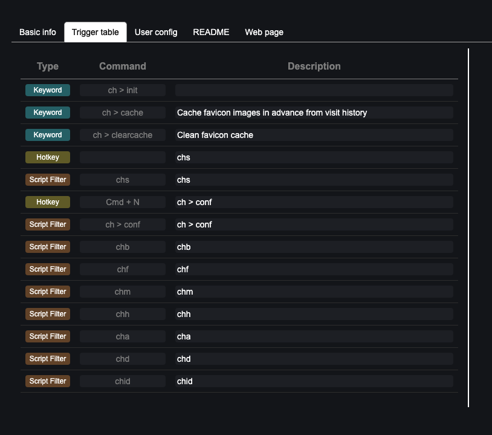
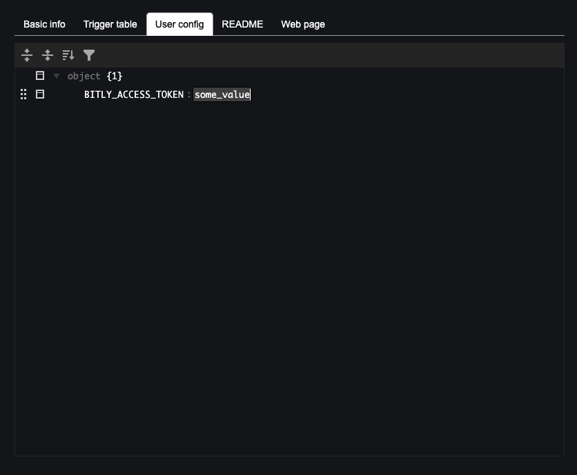
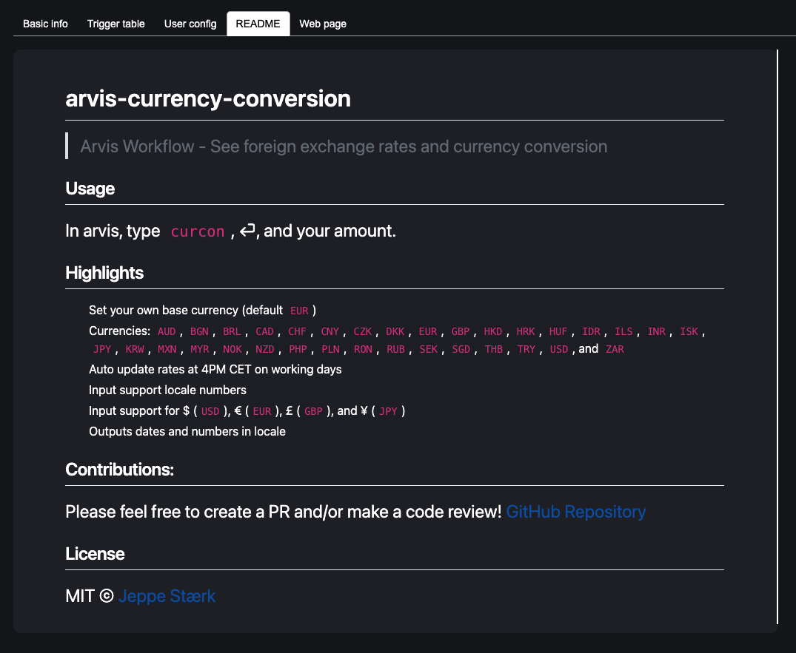
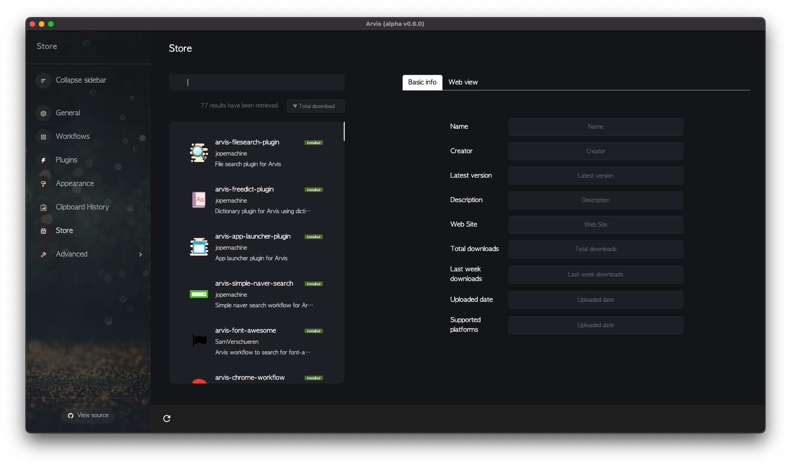
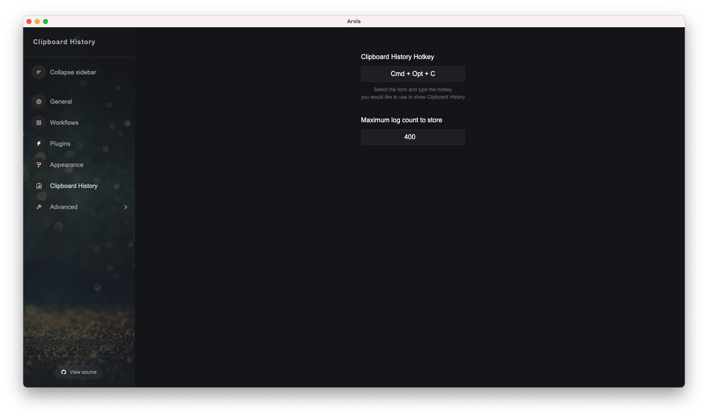
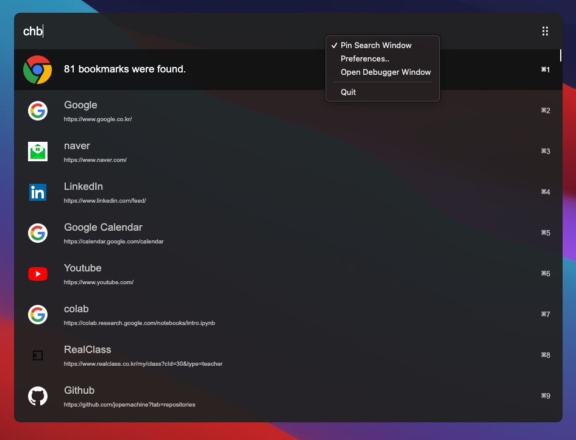
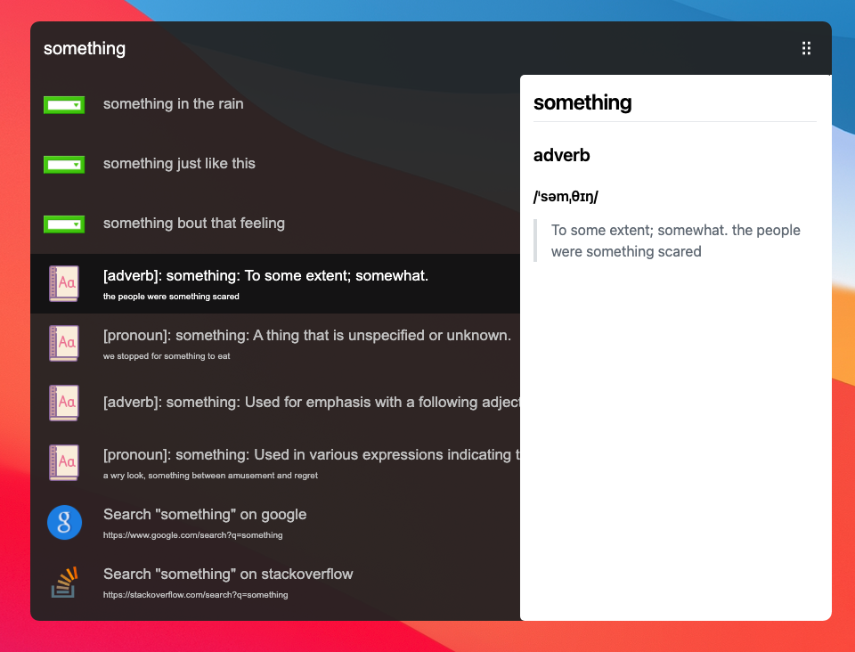
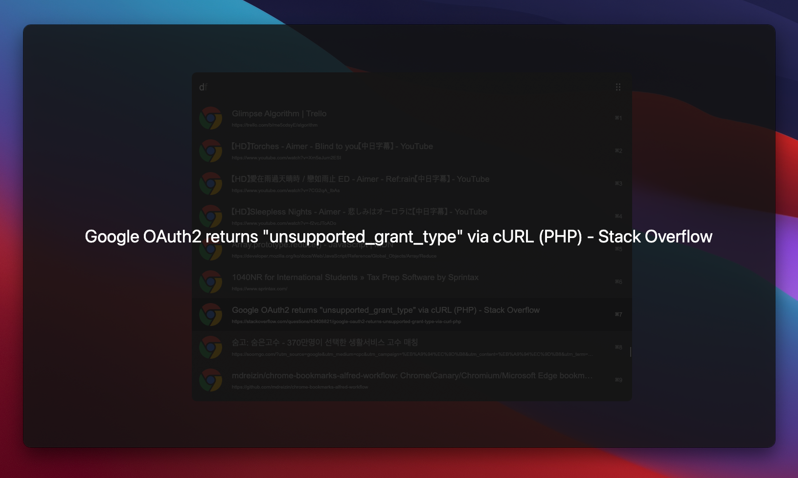
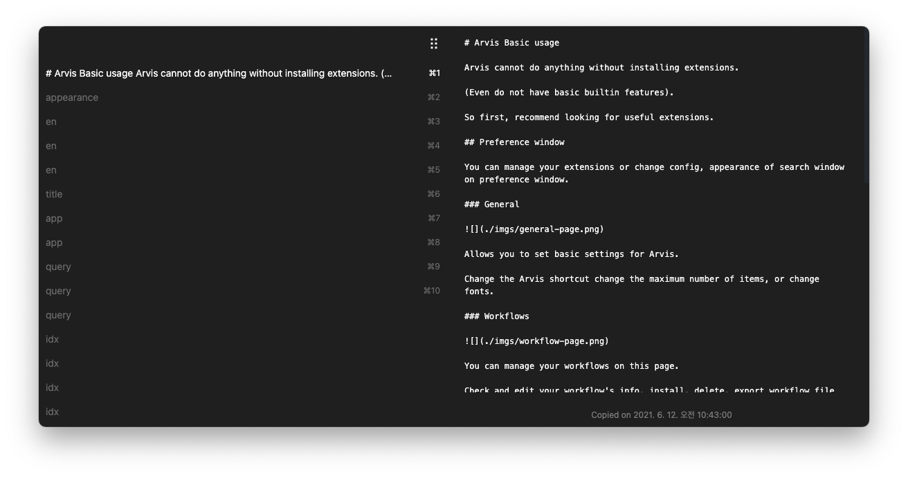

# :control_knobs: Arvis Basic usage

Arvis cannot do anything without installing extensions.

(Even do not have any builtin features).

So first, recommend looking for useful extensions.

You can look for and install lots of extensions through `store` page.

First, recommend searching for useful `plugins`.

## General

* ### Extension update notification

You can be notified if a particular extension is backward in version.

## Preference window

You can manage your extensions or change config, appearance of search window on preference window.

* ### General

Allows you to set basic settings for Arvis.

You can change the Arvis shortcut, the maximum number of items, and fonts.

Font can be set up system fonts installed in your OS.

* ### Workflows

You can manage your installed workflows on this page.

Check your workflow's info, install, delete file through the bottom bar.

To open your extension's folder, right click on extension and select `Open in Finder`.

You can also disable the extension by right-clicking on them, select `Disable`.

Disabled extensions are not used on your search.

#### Basic info

You can check the extension's basic information like creator, name, description, version.

#### Trigger table

In the trigger table, you can change or add triggers for specific commands

#### User config

You can set the extension's User config value (variables) like API key.

#### README

You can check README of the extension.

#### Web page

You can check web page of the extension.

* ### Plugins

You can manage your installed plugins on this page.

Check your plugin's info, install, delete plugin file through the bottom bar.

To open your extension's folder, right click on extension and select `Open in Finder`.

You can also disable the extension by right-clicking on them, select `Disable`.

Disabled extensions are not used on your search.

#### Basic info

You can check the extension's basic information like creator, name, description, version.

#### User config

You can set the extension's User config value (variables) like API key.

#### README

You can check README of the extension.

#### Web page

You can check web page of the extension.

### Appearence

Change search window's style to your style.

You can see search window's style update according to their setting values.

You can also import the `arvistheme` file to set predetermined setting values.

Or just click `theme` button to set predetermined setting values.

* ### Store

You can look for and install lots of extensions through `store` page.

Check the extension information on the web page and install, update the extension.

* ### Clipboard History

Change Clipboard History's setting.

* ### Advanced

#### History

#### Plugin

#### Debugging

Change debugging options according to your needs

## Search window

You can use your extension through this window.

To shows up search window, press `ctrl + space` (on mac, `cmd + space`)

* ### Window handle

You can drag your search window by holding press the handle.

* ### Window resize

Search window is resizable.

* ### Pin window

You can pin search window if you want.

This is useful when you want to pin window and check for some information.

Right click on search window, and select `Pin window`.

Your search window would be set `always on top`, and never disappear when you click other window.

* ### Quicklook

To view information about your selected item, press `shift + space`.

You can check the item's information on `markdown`, `html (webview)`, `text` renderer.

(Need to extension support)

Example:

You can also open quicklook by hovering your mouse to the right side of the search window.

In this case, if you left the mouse out of your quicklook, the quicklook disappears.

* ### LargeText window

To view your item in larger window, press `cmd (or ctrl) + L`

You can move your LargeText window by dragging non-text area.

You can adjust the size of the text of LargeText window by `mouse wheeling` with pressing `cmd (or ctrl)` key.

LargeText window is useful when your item have too long title. (For example, item displays some error message)

* ### Autocomplete

To autocomplete command, press `tab`.

## Clipboard history

You can look for and search your clipboard history through clipboard history window.

Default shortcut in Mac, `cmd + opt + c`, in other platforms, `ctrl + alt + c`.

You can also pin clipboard history window if you want.