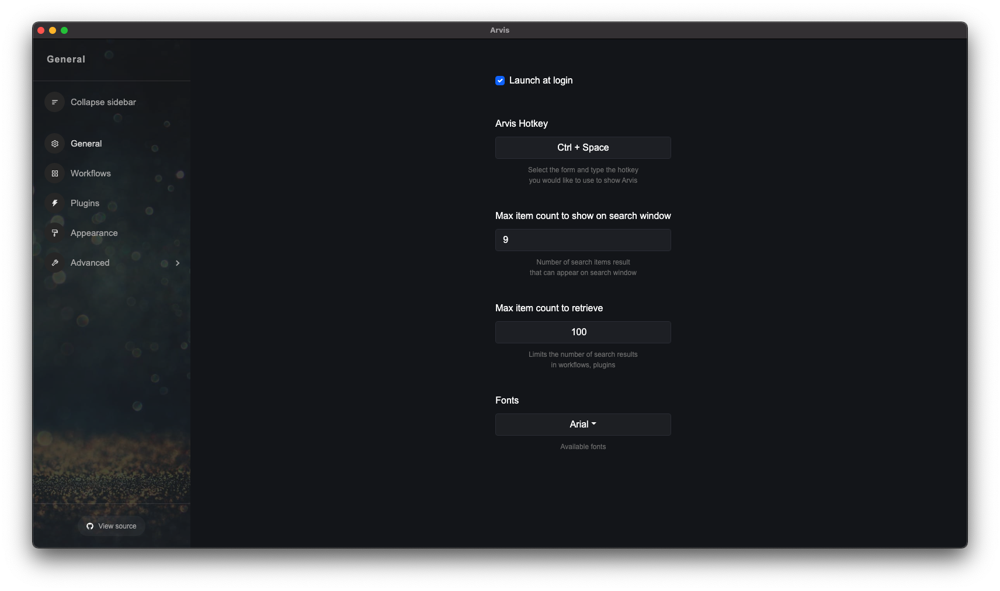
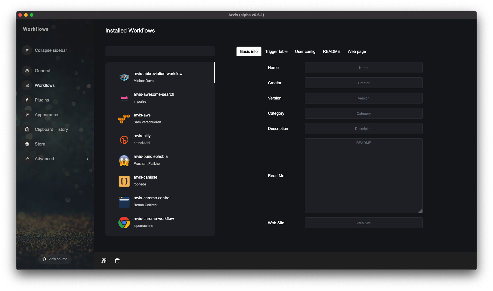
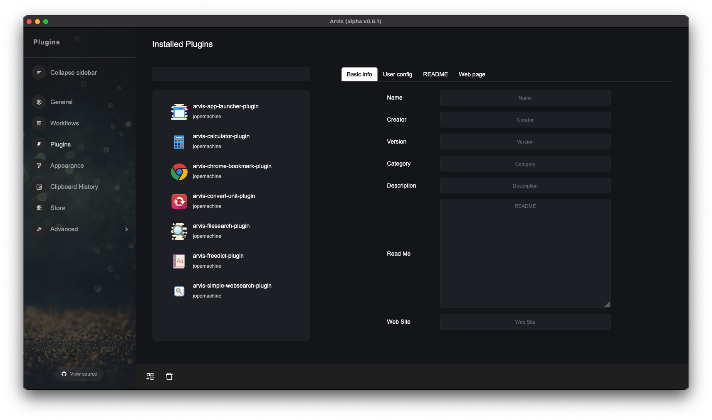
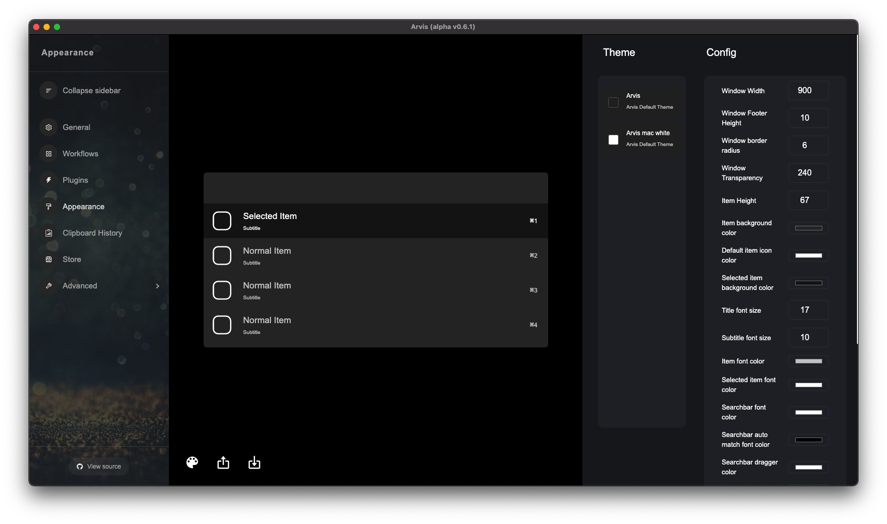
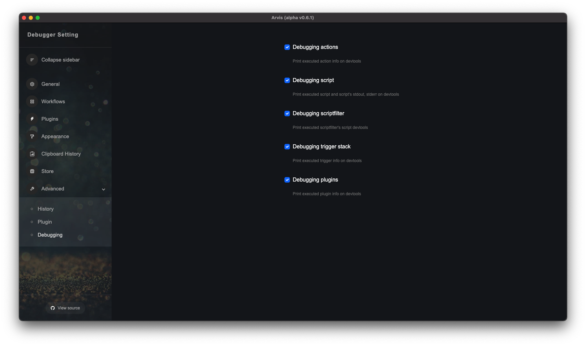

# Arvis Basic usage

Arvis cannot do anything without installing extensions.

(Even do not have basic builtin features).

So first, recommend looking for useful extensions.

## Preference window

You can manage your extensions or change config, appearance of search window on preference window.

### General

Allows you to set basic settings for Arvis.

Change the Arvis shortcut change the maximum number of items, or change fonts.

### Workflows

You can manage your workflows on this page.

Check and edit your workflow's info, install, delete, export workflow file through the bottom bar.

### Plugins

You can manage your plugins on this page.

Check and edit your plugin's info, install, delete, export plugin file through the bottom bar.

### Appearence

Change search window's style to your style.

You can see search window's style update according to their setting values.

### Advanced

Change debugging options according to your needs

## Search window

