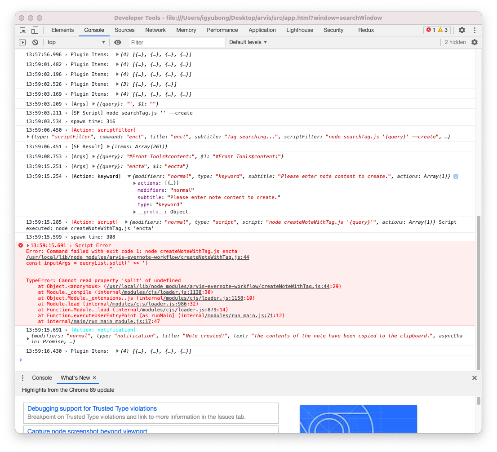

### Debugging workflow, plugin

1. You can debug your query, workflow, plugin's behaviors through chrome debugger.

To open SearchWindow's debugger view, you can click your tray icon and select `Show Debugging Window`.

You can check the debugging information of arvis, including information about workflow, plugin in the debugging window.

2. You can activate or unactivate log types to focus on your debugging on `Advanced` page.