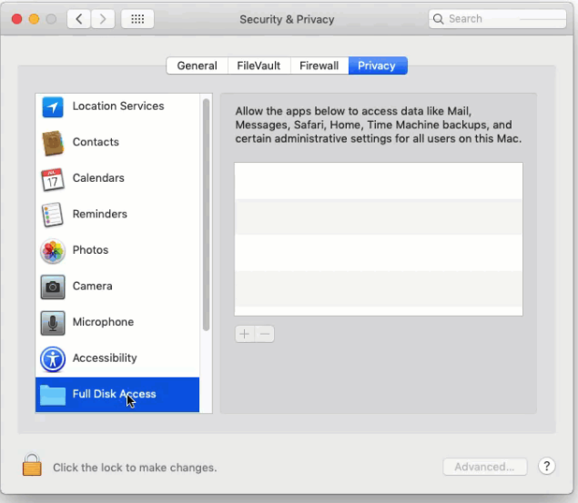

## 🌈 How to Install

1. Install [Node 12](https://nodejs.org/ko/download/) or higher because lots of extensions use Node.

2. Click [this link](https://github.com/jopemachine/arvis/releases) and download your platform's binary.

3. Right click Arvis's tray icon and click `Preference`.

4. Click Store page and install extensions you want.

5. Open mac's preference and `give appropriate permissions` to Arvis. (Including `Notification permissions` `Full disk access permission`)

