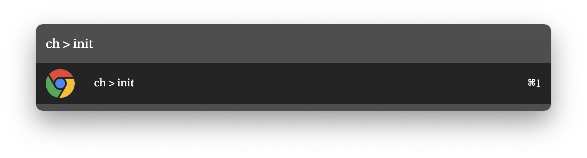

# Trigger

You can use `keyword`, `scriptfilter`, `hotkey` to trigger commands.

## Keyword

Command to invoke a specific command.

You can append query following keyword.

Example:

```json
{
  "type": "keyword",
  "command": "ch > init",
  "text": "Init your config file",
  "subtitle": "",
  "withspace": false,
  "arg_type": "no",
  "action": [
    {
      "modifiers": "normal",
      "type": "script",
      "script": "./node_modules/.bin/run-node src/init.js"
    }
  ]
}
```

In above example, you can see command with `ch > init`.

`Keyword` type executes the `action` when you pressed the item.

To trigger above `action`, you can type `ch > init` in your search window like this.



In above screen, your pressing enter event trigger the 'Action', `script`.

[Click me to check available attributes](./keyword-description.md)

## Scriptfilter

Unlike `Keyword` type don't have script, `scriptfilter` type has its `script_filter` on its own.

When `scriptfilter` runs, it executes the script specified in `script_filter`.

Example: 

```json
{
  "type": "scriptfilter",
  "command": "chb",
  "title": "chb",
  "subtitle": "Search chrome bookmark",
  "script_filter": "./node_modules/.bin/run-node src/fetchBookmark.js '{query}'",
  "running_subtext": "Searching...",
  "withspace": true,
  "arg_type": "optional",
  "action": [
    {
      "modifiers": "normal",
      "type": "open",
      "target": "{query}"
    },
    {
      "modifiers": "cmd",
      "type": "clipboard",
      "text": "{query}"
    }
  ]
},
```


When you type the command in search window, the commands shows up.

And you can give some query like `Keyword` type. the querys are passed in `script_filter` in form of `{query}`.

And result of the scripts shows in the search window, you can select and press them.

When you pressing the enter key on your selected item, `action` is triggered.

And action with `modifiers` key with other than `normal` is only triggered when you press the modifier key together.

[Click me to check available attributes](./scriptfilter-description.md)

## Hotkey

You can register `hotkey` to run a specific action or scriptfilter.

Example:

```json
{
  "type": "hotkey",
  "hotkey": "Double ctrl",
  "action": [
    {
      "modifiers": "normal",
      "type": "scriptfilter",
      "script_filter": "./node_modules/.bin/run-node src/selectProvider.js",
      "running_subtext": "Selecting accounts..",
      "withspace": false,
      "action": [
        {
          "modifiers": "normal",
          "type": "scriptfilter",
          "script_filter": "./node_modules/.bin/run-node src/fetchEmails.js 'UNSEEN' '{query}'",
          "running_subtext": "Fetching unread emails..",
          "withspace": false,
          "action": [
            {
              "modifiers": "normal",
              "type": "open",
              "target": "file://{query}"
            }
          ]
        }
      ]
    }
  ]
},
```

[Click me to check available attributes](./hotkey-description.md)