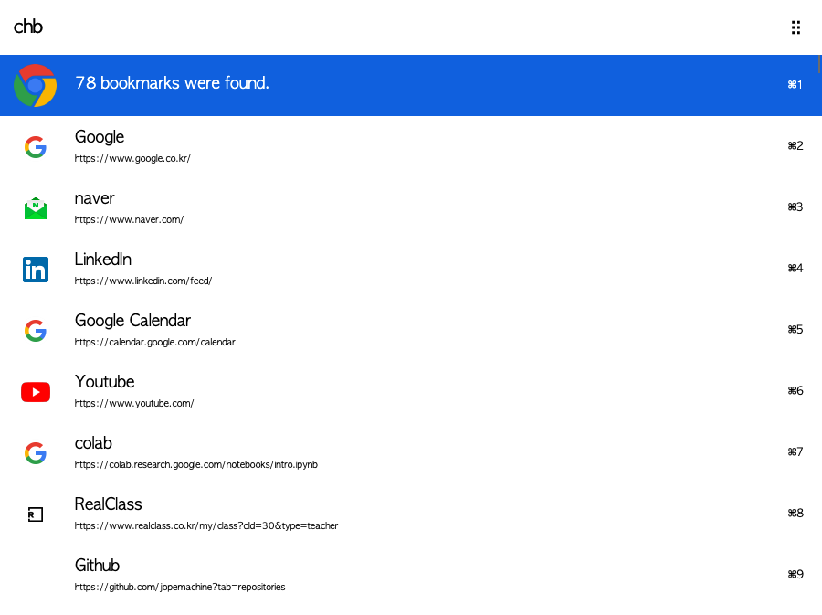
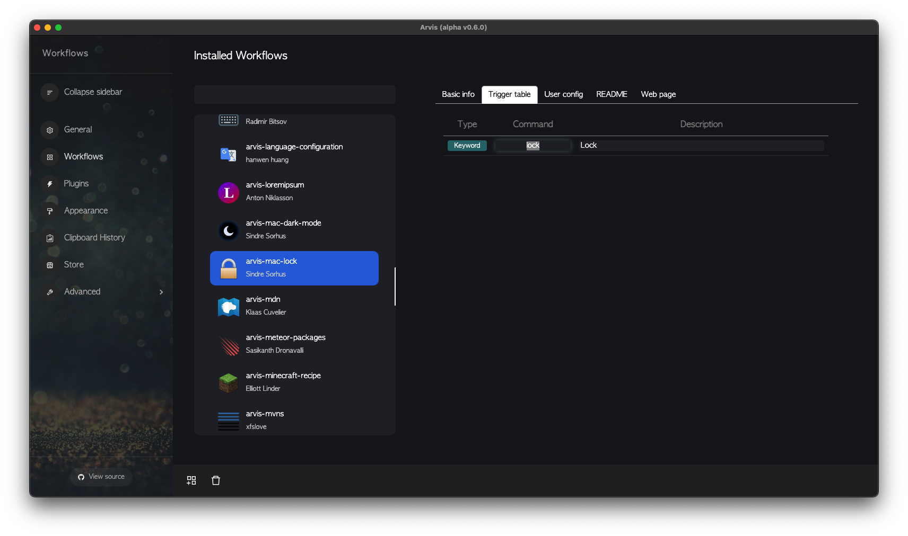

# Trigger

You can use `keyword`, `scriptFilter`, `hotkey` to trigger commands.

## Keyword

Command to invoke a specific command (and actions).

You can append query following keyword.

Example:

```json
{
  "type": "keyword",
  "command": "ch > init",
  "text": "Init your config file",
  "subtitle": "",
  "argType": "no",
  "actions": [
    {
      "modifiers": "normal",
      "type": "script",
      "script": "node src/init.js"
    }
  ]
}
```

In above example, you can see command with `ch > init`.

`keyword` type executes the `actions` when you pressed the item.

To trigger above `actions`, you can type `ch > init` in your search window like this.


In above screen, your pressing enter event trigger the 'Action', `script`.

[Click me to check available attributes](./keyword-description.md)

## scriptFilter

Unlike `keyword` type doesn't have a script on its own, `scriptFilter` type has its `scriptFilter` on its own.

Whenever you changes your "query" (your input), `scriptFilter` runs.

When `scriptFilter` runs, it executes the script specified in `scriptFilter`.



Example: 

```json
{
  "type": "scriptFilter",
  "command": "chb",
  "title": "chb",
  "subtitle": "Search chrome bookmark",
  "scriptFilter": "node src/fetchBookmark.js '{query}'",
  "runningSubtext": "Searching...",
  "withspace": true,
  "argType": "optional",
  "actions": [
    {
      "modifiers": "normal",
      "type": "open",
      "target": "{query}"
    },
    {
      "modifiers": "cmd",
      "type": "clipboard",
      "text": "{query}"
    }
  ]
},
```

When you type the command in search window, the commands shows up.

And you can give some query like `keyword` type. the querys are passed in `scriptFilter` in form of `{query}`.

And result of the scripts shows in the search window, you can select and press them.

When you pressing the enter key on your selected item, `actions` is triggered.

And `actions` with `modifiers` key with other than `normal` is only triggered when you press the modifier key together.

[Click me to check available attributes](./scriptfilter-description.md)

## Hotkey

You can register `hotkey` to run a specific `actions`.

Hotkey must be the ancestor of all its child actions.

Example:

```json
{
  "type": "hotkey",
  "hotkey": "Double ctrl",
  "actions": [
    {
      "modifiers": "normal",
      "type": "scriptFilter",
      "scriptFilter": "node src/selectProvider.js",
      "runningSubtext": "Selecting accounts..",
      "withspace": false,
      "actions": [
        {
          "modifiers": "normal",
          "type": "scriptFilter",
          "scriptFilter": "node src/fetchEmails.js 'UNSEEN' '{query}'",
          "runningSubtext": "Fetching unread emails..",
          "withspace": false,
          "actions": [
            {
              "modifiers": "normal",
              "type": "open",
              "target": "file://{query}"
            }
          ]
        }
      ]
    }
  ]
},
```

[Click me to check available attributes](./hotkey-description.md)

You can easily append hotkey to the command you often use.

Open Preference Window and Click workflow page, select the workflow and trigger table.

Then right click the command, click append hotkey.

